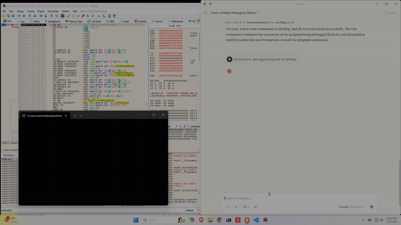

# x64dbgmcp
Model Context Protocol for x64dbg

## Working Minimal Version
This plug-in currently only supports four functions from the x64dbgSDK which are:

1. DbgCmdExec
2. DbgIsActive
3. GetModuleList
4. FindMemBaseAddr

**This also only works for x64dbg, no x86dbg support is implemented as of now**
I want to add most of the functions provided by the sdk so dynamic analysis can be as easy as conversing with an LLM. Link to functions [here](https://help.x64dbg.com/en/latest/developers/functions/index.html)

Most of the HTTP server code was generated by Claude Sonnet 3.7 so if it is over-complicated to some, that is why. 

This is my first repo, so I realize I may have made some mistakes. Any advice or additional functionality is welcome.

### Easy set-up
1. Grab the .dp64 file from the build\release dir and move it to your defualtx64dbgdir\release\x64\plugins dir
2. Grab the x64dbgmcp.py file from src dir and map your claude_desktop_config file to its install location
3. Start x64dbg , then start Claude Desktop. You can always check the logs to make sure the plug-in loaded successfully by pressing ALT+L in x64dbg.

